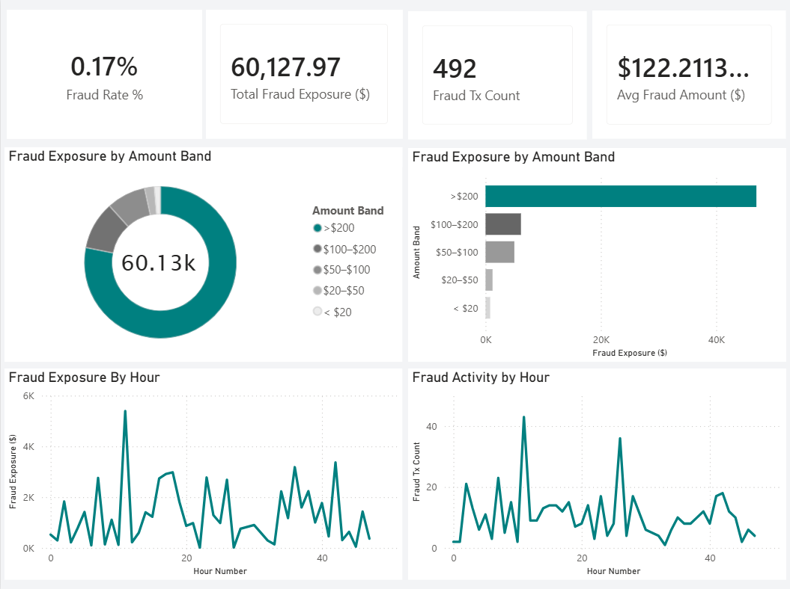

Overview

## Dashboard Preview

This project delivers an executive-style fraud analytics dashboard using an anonymized European credit card transactions dataset. The goal is to support high-level decision-making by quantifying fraud exposure, identifying where risk is concentrated, and highlighting temporal patterns in fraudulent activity.

Built with: MySQL + Power BI (DAX)

Business Problem (Executive Context)

Fraud is often low-frequency but high-impact. A company needs clear visibility into:

How often fraud occurs

How much money is exposed to fraud

Where fraud losses are concentrated

When fraud activity peaks, so controls can be targeted efficiently

Executive Questions Answered

Trend visibility: When does fraud activity and exposure peak over time?

Risk concentration: Are fraud losses driven by many small transactions or fewer high-value ones?

Operational focus: Which hours show elevated fraud risk requiring monitoring?

Strategic prioritization: Which transaction segments should be addressed first to reduce impact fastest?

KPIs Featured

Fraud Rate %

Total Fraud Exposure ($)

Fraud Transaction Count

Average Fraud Amount ($)

Key Insights (Summary)

Fraud is rare overall, but total exposure is meaningful due to loss concentration.

The majority of fraud exposure is concentrated in high-value transactions (>$200).

Fraud activity shows non-uniform hourly patterns, supporting time-based monitoring controls.
